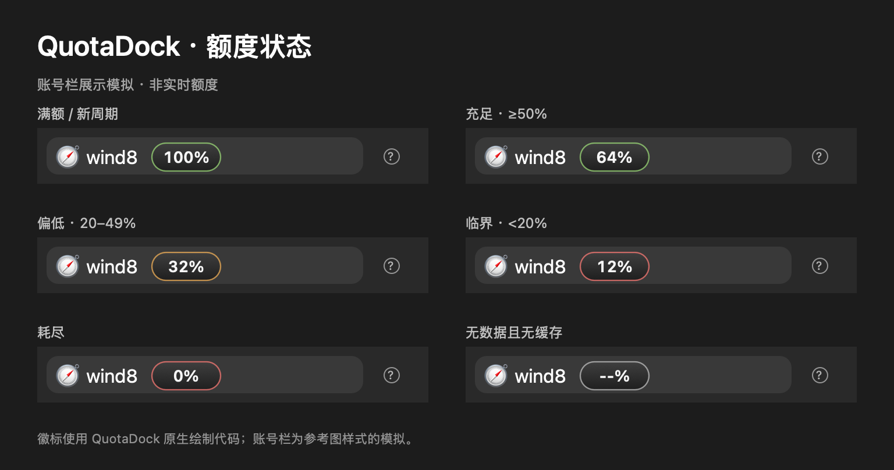

# QuotaDock

Swift/AppKit 独立 macOS 额度悬浮徽标，当前版本 **2.1（build 12）**。原工具名为 CodexQuotaBadge。

徽标贴在 ChatGPT/Codex 主窗口左下角、账号名右侧。窗口左侧偏移 **96 pt**，底部间距 **8 pt**，徽标大小 **64 × 30 pt**；这些数值沿用已确认的视觉对齐。不依赖宠物，也不修改 ChatGPT/Codex 应用包。

- 每 30 秒读取 `~/.codex/sessions` 下最近修改的 12 个 JSONL 文件，每个最多读取末尾 2 MB。
- 只接受 `event_msg / token_count` 中 `limit_id == "codex"` 的 `primary` 额度，过滤 Spark 独立额度；支持直接及 `info.rate_limits` 两种记录形式。显示的是 `100 - used_percent`，四舍五入并限制在 0–100。
- 以 `resets_at` 区分周期，同一周周期允许 120 秒的时间抖动。跨文件先选最新周期，再选该周期中最新观测；同一周期内缓存只下降，新周期允许回升。
- 缓存跨重启保留，最多保存 5 条记录。暂时没有可读回执时沿用缓存；无缓存时显示 `--%`。不直接请求额度服务，因此显示值可能滞后于当前账号状态。
- 绿色表示 ≥50%，琥珀色表示 20–49%，红色表示 <20%。徽标不拦截鼠标，不出现在 Dock 中。
- 每 0.05 秒跟随符合条件的窗口位置。识别窗口所有者 `ChatGPT` / `Codex`、宽 ≥800 pt、高 ≥600 pt；未找到目标时隐藏。坐标按所在显示器转换，不读取屏幕像素。

## 复刻与状态预览

[一段可直接交给 Codex 的复刻提示词](docs/recreate-prompt.md)。下图为六种合成额度状态，徽标复用原生绘制代码，账号栏按参考样式模拟；不代表实时额度。



在项目根目录执行 `./scripts/render-states.sh` 可重新生成此图，不读取会话、不写额度缓存，也不启动悬浮窗。

## 开发与构建

需要 macOS 11+、Apple Command Line Tools 或 Xcode，Swift 5.3+。直接使用 `swiftc`，不要求完整 Xcode 或 XCTest runtime；无第三方依赖。

源码维护于私有 monorepo [wind8ai/codex-tools](https://github.com/wind8ai/codex-tools) 的 `projects/quota-dock`。私有独立仓库 [wind8ai/quota-dock](https://github.com/wind8ai/quota-dock) 通过 subtree split 同步，不在项目目录中创建子仓。以下命令均在项目根目录执行：monorepo 中先进入 `projects/quota-dock`，独立 clone 中使用仓库根目录；也可以在其他目录使用脚本的绝对路径。

```sh
./scripts/test.sh
./scripts/build.sh
./scripts/sign.sh
```

`build.sh` 编译本机架构的 release 可执行文件，组装到项目的 `build/QuotaDock.app`；每次重新构建后需要重新签名。`sign.sh` 默认使用 ad-hoc 签名用于本机运行，校验签名后打印签名信息。

完整验证、构建、签名、打包：

```sh
./scripts/package.sh
```

输出到项目的 `dist/`：`QuotaDock-2.1-12-<arch>.zip`、对应 `.sha256` 和 `.build-info.txt`。构建记录包含源码提交、脏状态、Swift/SDK/macOS 和签名身份。相同输入可重复执行流程；不承诺跨 SDK、签名时间戳或 ZIP 元数据的逐字节一致。当前脚本构建本机单一架构，不声称是 universal binary。

指定现有签名证书：

```sh
SIGNING_IDENTITY='Developer ID Application: YOUR NAME (TEAMID)' \
  ./scripts/package.sh
```

证书模式启用 hardened runtime 和安全时间戳；脚本不会创建证书、上传或自动 notarize。对外分发还需完成 Apple notarization，参见 [发布规则](docs/releasing.md)。

## 启动、退出与旧版迁移

旧工具仍可能从 Documents 目录运行。先检查，避免启动两个重叠徽标：

```sh
ps -axo pid,command | grep -E '[C]odexQuotaBadge|[Q]uotaDock'
```

确认新构建和测试通过后，在活动监视器中结束旧 `CodexQuotaBadge`，再双击新 `QuotaDock.app`，或从项目根目录执行：

```sh
open build/QuotaDock.app
```

退出新版：在活动监视器中结束 `QuotaDock`，或 `pkill -x QuotaDock`。不自动添加登录项，重启后需再次启动。若手工登录项指向旧路径，正式切换时再更新它。

保留 bundle identifier `com.ben.codex-quota-badge` 和 `quota-history-v2` 缓存键，直接继续使用原 UserDefaults 数据；没有额外的迁移副本或双读 fallback。不要同时长期运行新旧应用。以后只有明确执行缓存迁移或重置时才更换此持久化标识。

本轮保留旧源码、`.app` 和 `.zip`，不自动移动、删除或切换运行实例。来源、校验和与验收记录见 [迁移记录](docs/migration.md)。

## 项目结构与测试

```text
Sources/QuotaDock/main.swift    AppKit 绘制、窗口追踪、定时刷新
Sources/QuotaCore/              额度解析、缓存稳定器、定位数值
Tests/QuotaCoreTests/           合成回执与隔离 UserDefaults 测试
Resources/Info.plist            应用元数据及版本唯一来源
scripts/                       测试、构建、签名、打包
docs/                          迁移证据及发布管理规则
build/  dist/  .build/          本地生成，不入 Git
```

测试脚本用 `swiftc -Onone` 编译核心源码及测试入口，执行 19 个使用 Swift 原生 `precondition` 的回归用例；断言失败或抛错会返回非零退出码。测试不读取真实账号回执，不写应用的正式缓存域。UI 实际跟随、遮挡、跨屏及视觉对齐仍需人工验收；窗口标题或尺寸规则无法覆盖的布局会影响定位。额度读取保留 2.1 的实现边界：只查最近 12 个文件、尾部必须能解码为 UTF-8、时间戳解析失败使用文件修改时间；账号切换没有独立缓存分区。
