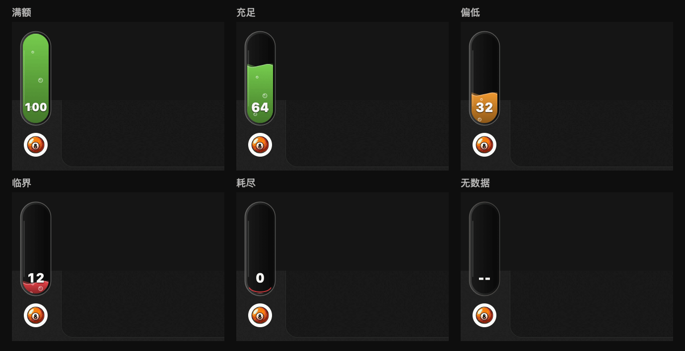
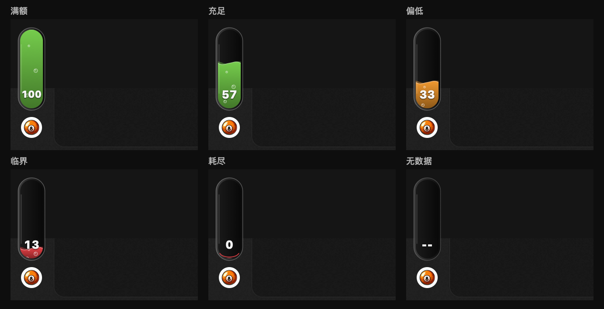

Codex 新版把头像挪了位置，我也把 QuotaDock 改成了头像上方的一根液体额度槽。剩多少，液面就有多高。气泡慢慢往上浮，百分比固定在底部。额度充足时是绿的，低于一半变橙，低于 20% 变红。

想做一个，可以把这段话发给 Codex：

> 用 Swift/AppKit 做一个 macOS 额度悬浮窗。在 ChatGPT/Codex 头像正上方放一根 32×96 pt 的玻璃胶囊，距头像顶部 6 pt。读取本地 Codex 主额度，每 30 秒刷新，过滤 Spark。用液面高度表示剩余百分比，加两层波动和上浮气泡，底部放 8 pt 白色数字，不加底板。至少 50% 为绿，20% 到 49% 为橙，低于 20% 为红。液位变化用 0.6 秒缓动，窗口隐藏时暂停，系统减少动态效果时保持静止。保留跨重启缓存和 120 秒周期容差，附测试、构建、签名和打包脚本。

六种额度状态的动态效果：

