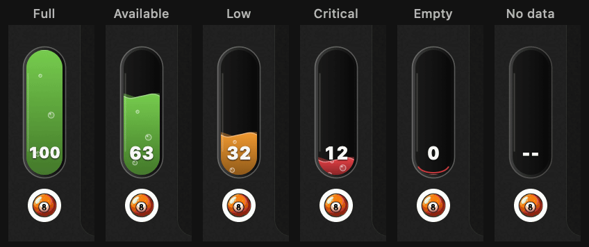

# Recreate QuotaDock

[中文](recreate-prompt.md) | **English**

Build a macOS quota overlay with Swift/AppKit. Place a 32×96 pt glass capsule above the ChatGPT/Codex avatar, with an 8 pt gap. Read the primary local Codex quota every 30 seconds, excluding Spark and preserving any source fractions. Represent remaining quota with the liquid height, two surface waves, and rising bubbles. At the bottom, show only a whole number, with no percent sign or background plate. Use a white 13 pt monospaced heavy font, shrinking long values to leave space at the sides. Use green for at least 50%, amber for 20% to below 50%, and red below 20%. Animate level changes over 0.6 seconds, pause when the target window is hidden, and keep the liquid still when Reduce Motion is enabled. Keep the cache across restarts with a 120-second cycle tolerance. Include tests and repeatable build, signing, and packaging scripts.

