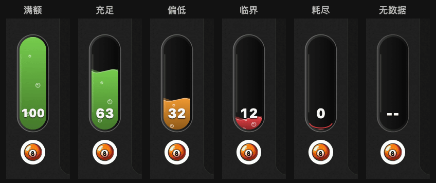

# 用 Codex 复刻

**中文** | [English](recreate-prompt.en.md)

用 Swift/AppKit 做一个 macOS 额度悬浮窗。在 ChatGPT/Codex 头像正上方放一根 32×96 pt 的玻璃胶囊，距头像顶部 8 pt。读取本地 Codex 主额度，每 30 秒刷新，过滤 Spark，并保留回执的小数。用液面高度表示剩余百分比，加两层波动和上浮气泡。底部仅显示整数数值，不加百分号或底板，使用 13 pt 白色等宽重体，长数值自动缩小以留出空隙。至少 50% 为绿，20% 到 49% 为橙，低于 20% 为红。液位变化用 0.6 秒缓动，窗口隐藏时暂停，系统减少动态效果时保持静止。保留跨重启缓存和 120 秒周期容差，附测试、构建、签名和打包脚本。

